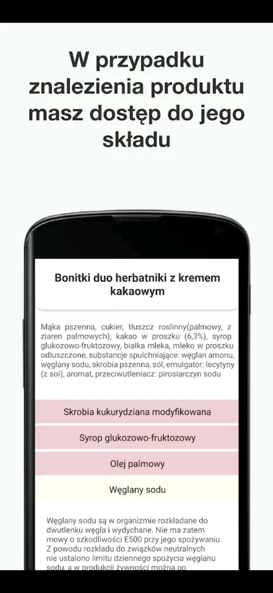

# Zdrowy Koszyk

React Native app to scan products ingredients

## Not found bundle?

react-native bundle --platform android --dev false --entry-file index.js --bundle-output android/app/src/main/assets/index.android.bundle --assets-dest android/app/src/main/res

## Run project

1. in one window: react-native start --reset-cache
2. in second: npx react-native run-android --deviceId={deviceId}

## Preview

