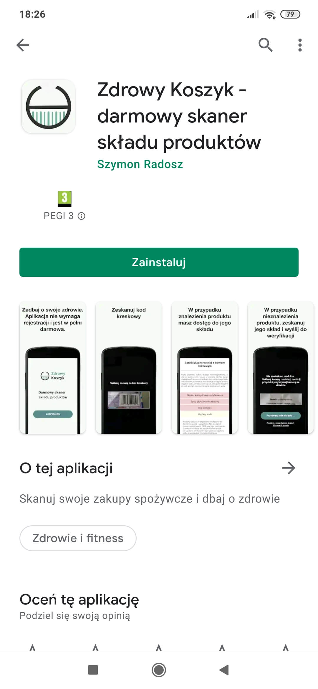
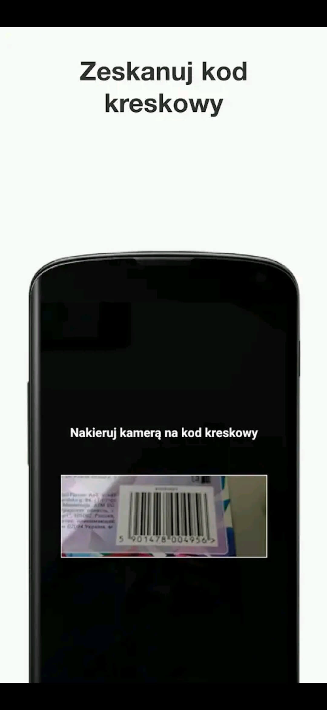
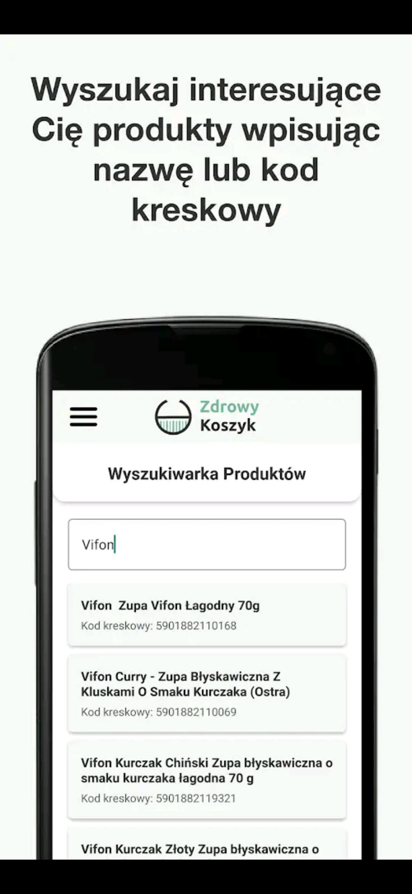

# Zdrowy Koszyk

React Native app to scan products ingredients

# android apk

1. rm -rf android/build
2. react-native bundle --platform android --dev false --entry-file index.js --bundle-output android/app/src/main/assets/index.android.bundle --assets-dest android/app/src/main/res
3. delete all folders drawable-{} except drawable
4. cd android
5. ./gradlew assembleRelease

apk file in android/outputs/apk/release/app-release.apk

# android aab

1. cd android
2. ./gradlew bundleRelease

## ios file

1. react-native run-ios --mode=Release

ios file in /Users/szymonradosz/Library/Developer/Xcode/DerivedData/zdrowyKoszykApp-cakxlgkcdudncrcrnczukmtzyjcy/Build/Products/Release-iphonesimulator/zdrowyKoszykApp.app

## Run project

1. in one window: react-native start --reset-cache
2. in second: npx react-native run-android --deviceId={deviceId}

## Preview

